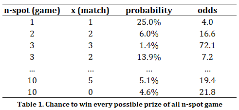
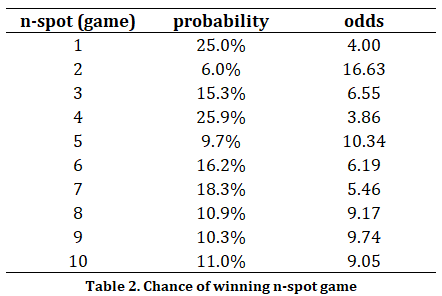
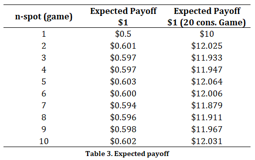
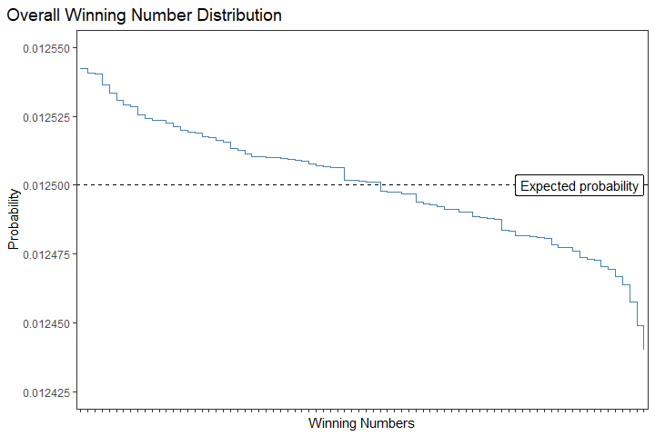
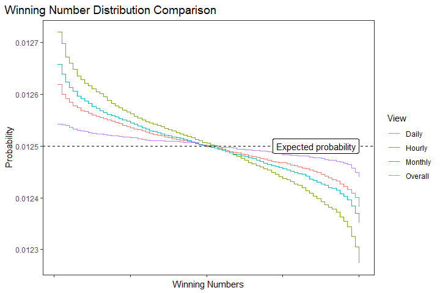
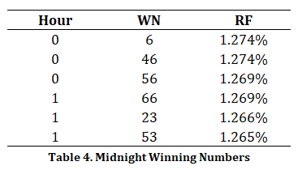
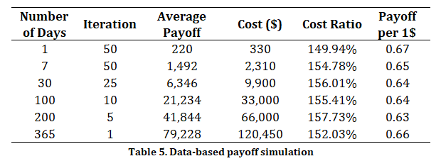

Can We Actually Earn Money from Gambling?
================


Asset illustration by [Afif Ramdhasuma](https://unsplash.com/@javaistan?utm_source=unsplash&utm_medium=referral&utm_content=creditCopyText) on [Unsplash](https://unsplash.com/photos/RjqCk9MqhNg?utm_source=unsplash&utm_medium=referral&utm_content=creditCopyText)

# Table of Content
- [The Quick Draw game](#the-quick-draw-game)
- [Talking about probabilities](#talking-about-probabilities)
  * [The definition](#the-definition)
  * [Probability vs Possibility](#probability-vs-possibility)
  * [The Hypergeometric distribution](#the-hypergeometric-distribution)
- [Odds of winning](#odds-of-winning)
  * [Chance to win](#chance-to-win)
  * [Expected payoff](#expected-payoff)
- [Analyzing historical data](#analyzing-historical-data)
  * [Is this some kind of pattern?](#is-this-some-kind-of-pattern)
    + [Overall distribution](#overall-distribution)
    + [Time-based distribution](#time-based-distribution)
- [Simulation, for real](#simulation-for-real)
- [Conclusion](#conclusion)
- [References](#references)

---

Gambling is a quick way to become rich, *they* said. Upon a peaceful night, one man can spend a hundred bucks and go home with a million, while another man can spend ten grand and earn nothing in return. Extremely high risk for a lump sum of money, yet lots of people can't live without it. But, can we actually earn money from gambling?

# The Quick Draw game

Quick Draw, one of the games from the New York Lottery, is a number-guessing-based gambling game where you can win money if you guess correctly. The rules are simple, players can guess up to 10 numbers anywhere from 1 to 80, and place a bet for that guess. Every 4 minutes, for 23 and half hours a day, the system will draw 20 winning numbers. To win the prizes, players' guesses need to match the winning numbers drawn. They offered $100K as the top prize for this particular game [1].

# Talking about probabilities

Probabilities… the ol’ enemy of my fellow colleagues back in the university. So, what exactly probability is?

## The definition

> For a given experiment, $S$ denotes the sample space and $A, A_1, A_2,...$ represent possible events. A set function that associates a real value $P(A)$ with each event $A$  is called a **probability set function**, and $P(A)$ is called the **probability $A$**, if $A_1, A_2,...$ are pairwise mutually exclusive events, and if the following properties are satisfied [2]:

$$
\begin{align*} 
&0\leq P(A) \\
&P(S)=1 \\ 
&P\left( \bigcup_{i=1}^{\infty}A_i \right)= \sum_{i=1}^{\infty}P(A_i) 
\end{align*}
$$

Kinda intense, isn’t it? Simply, probability is like guessing how likely something is to happen. It is expressed as a number between 0 and 1, where 0 means the event is impossible to happen, and 1 means the event is certainly to happen. For example, imagine a coin flip event, the outcome of this particular event is either head or tail. Now, the probability of guessing the outcome of a single coin flip result is head is 1 out of 2, or simplified to 1/2. This means there's a 50% chance of getting a head result because 1/2 is the same as 50%.

## Probability vs Possibility

Now that you’ve known what a **probability** is, you might also heard the term **possibility**. People often mix the use of terms probability and possibility, so what is the difference?

- Probability is the measure of how likely something is to happen. It is expressed as a number between 0 to 1, or a percentage from 0% to 100%
- Possibility is the collection of events that can happen but we do not know how likely each event is going to happen. It is often expressed as a count of all possible events, from 0 up to infinity

For instance, if you are guessing the outcome of a coin flip, the chance (probability) of getting a head flip is 50%, while the total possible outcome (possibility) is 2 events which are head and tail. 

## The Hypergeometric distribution

The Hypergeometric distribution, a discrete probability distribution, is defined as a measure of how likely an event happens k times in n trials when you are sampling from a population **without replacement**. Suppose a population consists of a finite number of items, say $N$, and there are $M$ items to observe, and the remaining $M-N$ items are not to be observed. Suppose $n$ items are drawn at random ***without replacement,*** and denote by $X$ the numbers of observed items that are drawn [2]. The probability density function of $X$ is given by

$$
\text{Pr}(x;n,M,N)=\dfrac{\displaystyle {M \choose x}{N-M \choose n-x}}{\displaystyle {N \choose n}}
$$

and $X$ is said to follow the Hypergeometric distribution.

# Odds of winning

The overall odds of winning for Quick Draw game is presented at their official website along with its prizes. But then you asking yourself, why the odds of winning 7-spot game is displayed higher than 10-spot game? You might also wonder why they giving out prizes for 0 match on 6 to 10-spot game? So, let’s do the math!

## Chance to win

Suppose $X$ is a discrete random variable of matches numbers in an n-spot Quick Draw game. Starting with a set of all possible events with the size of  $m$ that can happen (or all possible numbers, 1-80), then from this set you pick a subset the with size of $n$ (the number you pick on your Quick Draw ticket). From the original set, there are $r$ events that are considered as “successes” (the winning number drawn by the system), and you want the probability of some number $x$ of these “successes” is be included in your picked subset [3]. This exact scenario follows the Hypergeometric distribution.

$$
X \sim \text{Hypergeometric}(m,r,n)
$$

Hence, the probability of $X$ is

$$
\text{Pr}(X=x)= \dfrac{\displaystyle {r \choose x}{m-r \choose n-x}}{\displaystyle {m \choose n}}
$$

Now, let’s calculate the probability of winning a simple 1-spot Quick Draw game. We know that $m$ is 80 since there are 80 possible numbers to pick, $r$ is 20 since each Quick Draw’s draw is 20 numbers, $n$ is 1 as the number we pick is only 1, and $x$ is equal to 1 as the number of success events we want. Plugging all numbers into the equation, we obtain

$$
\text{Pr}(X=1)=\dfrac{\displaystyle {20 \choose 1}{80-20 \choose 1-1}}{\displaystyle {80 \choose 1}}=\dfrac{20}{80}=25\%
$$

Computing all of the possible event, with the help of computation tools (R Studio):



Table 1 shows the probability of all the possible win conditions of this game. The event win is defined as getting paid from the game. The value of “odds” is presented as the inverse of probability or can be interpreted as *a “1 out of odds”* phrase. You might also notice that the probability of getting 0 matches in a 10-spot game is 4.6%, surprisingly lower than the probability of getting half of the 10 guesses to match the drawn number. This is not a miscalculation though, the probability of getting no match is lower, thus it should make sense that they giving out an amount of money that is bigger than getting 5 matches.



Table 2 shows the probability of winning any n-spot game. The event winning an n-spot game here is equivalent to winning any prize for any n-spot game. For 1 and 2-spot games, the winning probability is as same as its individual counterparts, but for the rest is the sum of the probability of each prized match. For example, the probability of winning a 5-spot game is the sum of the probability of winning 5 matches (0.1%), 4 matches (1.2%), and 3 matches (8.4%) which adds up to 9.7%. Why is the sum? Since every event of individual wins is an independent event, the probability of those events together is as simple as summing them. From here, you should have noticed the reason why the odds of winning a 7-spot game are higher than winning the 10-spot one. Ultimately, you also learned that the most likely game to win is the 4-spot game.

## Expected payoff

After you learnt how the “basic” probability of Quick Draw game works, you asked yourself, *“is there any way to calculate the expected payoff from dollar spent on each game?”*. The answer is obvious, yes it is! We can use the feature of probability distribution to calculate the expected value of the desired scenario.

> Let $Y$ be a discrete random variable of payoff from a Quick Draw game

The expected payoff is equal to the expected value of $Y$, such as

$$
\text{E}[Y]=\sum_{i}^{}{y_i\text{Pr}(Y=y_i)}
$$

For example, the expected payoff for 3-spot game is

$$
\begin{align}
\text{E}[\text{3-spot}] &= \$23\times P(Y=3)+\$2\times P(Y=2) \\ 
&= \$23(13.88\\%)+\$2(1.39\\%) \\ 
&= \$0.597 
\end{align}
$$

Yes, the expected payoff of a 3-spot game is less than $1, making every game is a money-wasting instead of money-gaining. Again, computing all available scenario (n-spot) with R Studio, we obtain



Table 3 shows the expected payoff for each $1 played on a Quick Draw game. As you can see, no expected payoff is larger than $1, which means that for every dollar you play in this game, you will lose around 40-50 cents. The right-most column of the table shows the expected payoff for 20 consecutive $1 games, which means for every $20 you are expected to halve your “investment”. *See? gambling is not a way to earn money :).*

# Analyzing historical data

So, lucky me, I found bunch of dataset related to this work on Kaggle. Thanks to this data publisher [4], now we can do some analysis regarding the historical data of Quick Draw game.

```r
library(data.table)
library(tidyverse)

# Importing dataset also doing some preprocessing stuffs
qd = fread('unzip -p Lottery_Quick_Draw_Winning_Numbers__Beginning_2013.csv.zip')
qd[, Date := mdy_hm(paste(`Draw Date`, `Draw Time`))]
qd[, Days := wday(Date, label = TRUE, abbr = FALSE)]
qd[, Months := month(Date, label = TRUE, abbr = FALSE)]
qd[, Hours := hour(Date)]

# Getting the data ready
qd_unlist <- qd %>% 
  transmute(
    Date, Days, Months, Hours,
    WN = map(`Winning Numbers`, function(x) {
      unlist(str_split(x, " "))})
  ) %>% 
  unnest_longer(WN)
```

## Is this some kind of pattern?

Of course, the very thing to find out is whether there is somehow any pattern of the winning numbers. To address this, I proposed to analyze the relative frequency of the winning numbers viewed from several perspectives.

### Overall distribution

```r
overall <- qd_unlist %>% 
  count(WN) %>% 
  mutate(pct_n = n/sum(n))
```

Using simple *magic* (re: scripting), the overall winning numbers distribution is plotted below.



The expected probability is calculated by dividing each possible number by the total count of all possible numbers, which is 1 out of 80 or equal to 1.25%. What the line plot above is trying to tell us? So the relative frequency, or the empirical probability, of the winning numbers is not uniformly distributed the whole time. There are some numbers with higher relative frequency, but there are also lower numbers. The deviation from the expected probability is averaged around ±0.005%, but does this actually impact our probability of winning Quick Draw?

### Time-based distribution

For now, let’s save the previous question for later. Next is to see the relative frequency based on monthly, daily, and hourly period.

```r
monthly_pattern <- qd_unlist %>% 
  count(Months, WN) %>%
  group_by(Months) %>% 
  mutate(pct_n = n/sum(n))

daily_pattern <- qd_unlist %>% 
  count(Days, WN) %>%
  group_by(Days) %>% 
  mutate(pct_n = n/sum(n))

hourly_pattern <- qd_unlist %>% 
  count(Hours, WN) %>%
  group_by(Hours) %>% 
  mutate(pct_n = n/sum(n))
```

And the plot is here



Woah! The deviation is increasing! For the hourly view, the deviation is averaged to ±0.02%, and for the daily and monthly view are also higher than the overall relative frequency’s deviation. Hold on, this might be too quick for you. So, what hourly view means is to see the relative frequency distribution grouped by the hour the draws were drawn.



For example, the highest relative frequency of winning numbers at midnight hours is 6, 46, 56, 66, 23, and 53. The numbers vary for each hour of draws, and the aggregated distribution is shown in the line plot above. This makes us think even more, **can these findings increase our luck of winning?**

# Simulation, for real

To answer the question, let’s do a simulation! Using the highest winning odds game, which is the 4-spot game, and following the hourly pattern of winning numbers.

Here is the simulation algorithm:

1. There are 15 draws per hour, so the number of games played each hour will be 1-draw game for 15 times.
2. Each game is going to use the same numbers which numbers chosen from the top 4 highest empirical probability numbers for each corresponding hour.
3. To get many samples, I will simulate for 22 hours per day (all hours but 3 and 4 AM) on a large number of days.

Scripts:

```r
# Get the date which satisfies simulation algorithm above
ideal_dates <- qd[, .N, by = c("Draw Date", "Hours")][N == 15][, .N, by = "Draw Date"][N == 22, `Draw Date`]

# Get the top 4 numbers for each hour
guessing_number <- hourly_pattern %>% 
  filter(Hours != 3) %>% 
  group_by(Hours) %>% 
  slice_max(order_by = pct_n, n = 4, with_ties = FALSE) %>% 
  ungroup() %>% 
  select(Hours, WN) %>% 
  as.data.table()

# Payoff table
payoff_table <- data.table(
  matches = c(0:4),
  prize = c(0, 0, 1, 5, 55),
  key = "matches"
)

# Helper functions
get_match <- function(x, wn) {
  WN <- unlist(str_split(wn, " "))
  n_match <- sum(x %in% WN)
  return(n_match)
}

get_pay_hour <- function(date, hour) {
  x <- guessing_number[Hours == hour, WN]
  subset_hour <- qd[`Draw Date` == date][Hours == hour, .(`Winning Numbers`)]
  x_match <- sapply(subset_hour$`Winning Numbers`, function(wn) {get_match(x,wn)}, 
                    USE.NAMES = FALSE)
  subset_hour[, matches := x_match]
  setkey(subset_hour, "matches")
  payoff <- sum(payoff_table[subset_hour][,prize])
  return(payoff)
}

get_pay_day <- function(date) {
  hour_tries <- c(0:2, 5:23)
  payoff <- sum(sapply(hour_tries, function(hour) get_pay_hour(date, hour)))
  return(payoff)
}

get_pay_simulation <- function(n) {
  sampled_date <- data.table(
    date = sample(ideal_dates, n)
  )
  sampled_date[, payoff := sapply(sampled_date$date, get_pay_day)]
  return(sampled_date[, sum(payoff)])
}

# Usage
mean(sapply(1:10, function(n) get_pay_simulation(100)))
mean(sapply(1:5, function(n) get_pay_simulation(200)))
mean(sapply(1:1, function(n) get_pay_simulation(365)))
```

Here are the results.



Surprised? No? Yes? Using the kind-of-pattern from the hourly relative frequency view which has the highest deviation among the other approaches, the simulation results show that the expected payoff per $1 is *still* less than $1. Though the expected payoff is slightly larger than the theoretical value ($0.597 per $1), the fact that we do not earn money remains true. So, the answer is for the previous question is **YES**, there is a **slight** change in our probability of winning, **BUT,** when it comes to the payoff, there is **NO** change in the fact that we are **expected to not earn money** by playing Quick Draw.

# Conclusion


Finally, the truth is unveiled. Playing the NY Quick Draw game will always cost you money instead of rewarding you, **theoretically** and **empirically**. Yet, some people out there constantly spend their sums of money in the hope that their money will eventually multiply. Sadly, similar behavior is also seen in my home country, Indonesia. Many young adults and middle-aged "trapped" in the loop of gambling-based games which I can't name but it is popularly-local-known as the "Kakek Zeus" game. Now that you've learned that gambling can lead you to **bankruptcy**, so, do not ever try it, okay? :)

— *unless you love to do charity, then it is OK /jk*

---

# References

[1] *Quick draw game detail*. (2023). New York Lottery: Official Site. [https://nylottery.ny.gov/draw-game/?game=quickdraw](https://nylottery.ny.gov/draw-game/?game=quickdraw)

[2] Engelhardt, M., & Bain, L. J. (2000). *Introduction to probability and mathematical statistics (duxbury classic)* (2nd ed.). Duxbury Press.

[3] Lock, K. (2007). Mixing a night out with probability… & making a fortune. *Math Horizons*, *14*(3), 8–9. [https://doi.org/10.1080/10724117.2007.11974689](https://doi.org/10.1080/10724117.2007.11974689)

[4] Kapadnis, Sujay. (2023, September). Is Lottery a game of Luck?. Version 1. Retrieved Sep 15, 2023 from [https://www.kaggle.com/datasets/sujaykapadnis/is-lottery-a-game-of-luck](https://www.kaggle.com/datasets/sujaykapadnis/is-lottery-a-game-of-luck)
